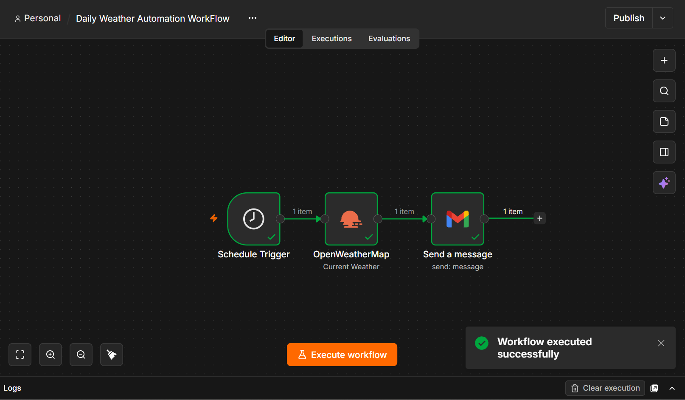
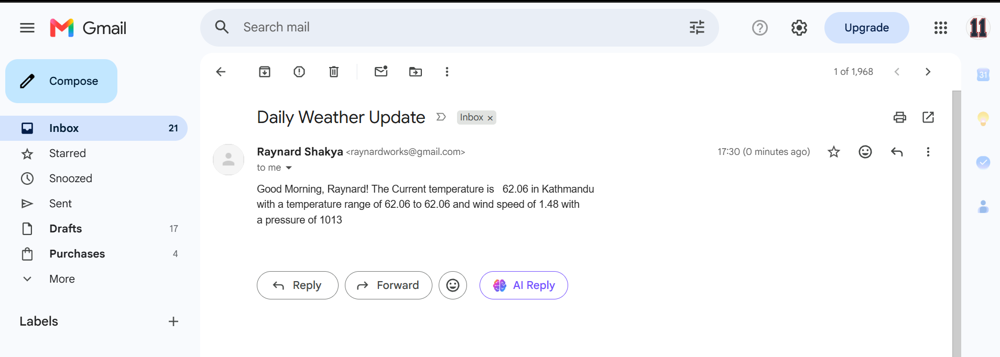

# Automated Daily Weather Emailer (n8n Workflow)

An automated, scheduled workflow built using n8n that fetches current weather conditions for a specified location every morning and sends a personalized email summary via Gmail.

---

## Features

- **Scheduled Trigger:** Automatically executes every day at 5:00 AM.
- **Real-Time Weather Data:** Integrates with the OpenWeather API to fetch temperature, conditions, location, and wind speed.
- **Dynamic Content Formatting:** Formats and maps weather metrics dynamically into an email body using JSON data mapping.
- **Automated Dispatch:** Dispatches an email report via Gmail API.

---

## Architecture and Workflow

The workflow consists of three primary nodes:

1. **Schedule Trigger:** Configured to trigger daily at 05:00 AM.
2. **OpenWeather Node:** Calls OpenWeather API using API key credentials to retrieve current weather data by city name.
3. **Gmail Node:** Maps dynamic temperature and weather variables into the body text and sends the automated message to the recipient.

---

## Screenshots

### Workflow Canvas

### Email Output

---

## How to Import and Use

### Prerequisites
- An active instance of **n8n** (Cloud or Self-Hosted via VPS/Docker).
- An **OpenWeather Map API key** (Free tier available at [openweather.org](https://openweather.org)).
- A **Gmail / Google Account** connected via OAuth2 in n8n.

### Installation Steps

1. **Download Workflow File:**
   Download the `Daily Weather Automation WorkFlow.json` file from this repository.

2. **Import into n8n:**
   - Open your n8n editor canvas.
   - Click **Workflow** menu in the top right → **Import from File**.
   - Select `Daily Weather Automation WorkFlow.json`.

3. **Configure Credentials:**
   - **OpenWeather:** Add your OpenWeather API key to the OpenWeather node credentials.
   - **Gmail:** Authenticate your Google/Gmail OAuth credentials in the Gmail node.

4. **Customize Settings:**
   - Set your desired location (Zip Code or City Name) in the OpenWeather node.
   - Set your recipient email address in the Gmail node.

5. **Activate:**
   - Toggle the workflow switch to **Active** at the top right of your canvas.

---

